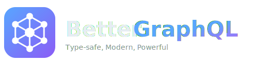

<p align="center">
  
</p>

<h1 align="center">bgql</h1>

<p align="center">
  <strong>Better GraphQL</strong> - A GraphQL superset that addresses fundamental limitations in the type system and streaming capabilities.
</p>

<p align="center">
  <a href="https://github.com/ubugeeei/bgql/actions"></a>
  <a href="https://github.com/ubugeeei/bgql/blob/main/LICENSE"></a>
</p>

---

> [!WARNING]
> **This project is under active development and is NOT production ready.**
> The API may change without notice. Do not use in production environments.

> [!NOTE]
> **Not yet published.** The crates and npm packages are not yet available on crates.io or npm.
> To use bgql, you need to build from source.

---

## Why bgql?

GraphQL is powerful, but has fundamental limitations that force workarounds:

| Problem | GraphQL Workaround | bgql Solution |
|---------|-------------------|---------------|
| Nullable by default, non-null is opt-in (`!`) | Convention + manual checking | Non-null by default, `Option<T>` for nullable |
| No nominal typing | Scalar type aliasing loses type safety | `opaque` types with compile-time checks |
| No generics | Copy-paste `UserConnection`, `PostConnection`... | `Connection<T extends Node>` |
| Enums are just strings | Cannot associate data with variants | Rust-style enums: `Ok(User) \| NotFound { id }` |
| No input polymorphism | Multiple nullable fields + runtime validation | `input enum` discriminated unions |
| No binary data | Base64 encoding (33% overhead) or separate endpoints | Native `@binary` streaming |
| No streaming control | Stateless requests | `@resumable` pause/resume with checkpoints |
| No execution priorities | All queries equal | `@priority` scheduling with preemption |
| No server/client boundary | Framework-specific RSC | `@server`, `@boundary`, `@island` directives |
| No module system | Single global namespace, file concatenation | `mod`, `use`, `pub` (Rust-style) |
| No schema versioning | URL versioning or forever backwards-compatible | `@version`, `@since`, `@deprecated` with removal schedule |
| Loose endpoint spec | Only `/graphql` convention, no standard | Strict endpoint specification with introspection, health, metrics |
| No i18n support | Manual field duplication or resolver logic | `@localized` directive with fallback chain |

**bgql is a strict superset** - all valid GraphQL is valid bgql. You can adopt features incrementally.

### Feature Categories

| Category | bgql Extension | Description |
|----------|---------------|-------------|
| **Type System** | `Option<T>`, `List<T>` | Non-null by default, explicit optionality |
| | `opaque` | Nominal typing with compile-time checks |
| | Generics `<T>` | Type parameters with constraints |
| | Rust-style `enum` | Variants with associated data |
| | `input enum` | Discriminated union inputs |
| **Streaming** | `@binary` | Native binary data streaming |
| | `@hls` | Adaptive video streaming |
| | `@resumable` | Pause/resume with checkpoints |
| **Execution** | `@priority` | Query priority levels |
| | `@resources` | Resource hints (CPU, I/O) |
| **Component Model** | `@server` | Server-only fragments |
| | `@boundary` | Server/client data boundaries |
| | `@island` | Partial hydration control |
| **Module System** | `use` | Rust-style imports |
| | `mod` | Module declarations |
| | `pub` | Visibility modifier |
| **Versioning** | `@version` | Schema version declaration |
| | `@since` | Field availability version |
| | `@deprecated` | Deprecation with removal schedule |
| **i18n** | `@localized` | Locale-aware field resolution |
| | `Accept-Language` | Automatic locale detection |

---

## Specification

> [!IMPORTANT]
> **For detailed specifications, please refer to the [`spec/`](./spec) directory.**

| Document | Description |
|----------|-------------|
| [00-overview.md](./spec/00-overview.md) | Introduction and design goals |
| [01-type-system.md](./spec/01-type-system.md) | Type system (Option, List, Generics, Opaque, Input Enum) |
| [02-schema-definition.md](./spec/02-schema-definition.md) | Schema Definition Language (SDL) |
| [03-directives.md](./spec/03-directives.md) | Built-in directives including streaming and component model |
| [04-query-language.md](./spec/04-query-language.md) | Query language extensions |
| [05-http-protocol.md](./spec/05-http-protocol.md) | HTTP protocol, binary streaming, and HLS support |
| [06-execution.md](./spec/06-execution.md) | Query execution model |

---

## Type System Extensions

### Non-null by Default with `Option<T>`

**GraphQL problem:** Nullable by default requires `!` everywhere, easy to forget.

```graphql
# GraphQL: Must remember ! on every field
type User {
  id: ID!
  name: String!
  bio: String         # Oops, forgot ! - now nullable unintentionally
}
```

**bgql solution:** Non-null by default, explicit `Option<T>` for nullable.

```graphql
# bgql: Non-null by default, intentional nullability
type User {
  id: ID                      # Non-null
  name: String                # Non-null
  bio: Option<String>         # Explicitly optional
  posts: List<Post>           # Non-null list of non-null posts
}
```

### Opaque Types (Nominal Typing)

**GraphQL problem:** Scalar aliases provide no type safety.

```graphql
# GraphQL: Both are just ID at runtime
scalar UserId
scalar PostId

# This compiles but is a bug - wrong ID type
query { user(id: $postId) { name } }
```

**bgql solution:** `opaque` types are distinct at compile time.

```graphql
# bgql: Compile-time distinct types
opaque UserId = ID
opaque PostId = ID

# Compile ERROR: expected UserId, got PostId
query { user(id: $postId) { name } }
```

### Generic Types

**GraphQL problem:** No generics forces copy-paste.

```graphql
# GraphQL: Must define for every type
type UserConnection {
  edges: [UserEdge!]!
  pageInfo: PageInfo!
}
type UserEdge {
  node: User!
  cursor: String!
}
type PostConnection {
  edges: [PostEdge!]!
  pageInfo: PageInfo!
}
# ... repeat for every paginated type
```

**bgql solution:** True generics with constraints.

```graphql
# bgql: Define once, use everywhere
type Connection<T extends Node> {
  edges: List<Edge<T>>
  pageInfo: PageInfo
  totalCount: Uint
}

type Edge<T> {
  node: T
  cursor: String
}

# Usage
type Query {
  users: Connection<User>
  posts: Connection<Post>
}
```

### Enums with Associated Data

**GraphQL problem:** Enums are just strings, cannot carry data.

```graphql
# GraphQL: Must use union + separate types
union UserResult = User | NotFoundError | UnauthorizedError

type NotFoundError {
  id: ID!
  message: String!
}
type UnauthorizedError {
  message: String!
}

# 3 separate type definitions for one concept
```

**bgql solution:** Rust-style enums with inline data.

```graphql
# bgql: Variants with associated data (3 forms)
enum UserResult {
  Ok(User)                              # Tuple-style: wraps existing type
  NotFound { id: UserId, message: String }  # Struct-style: inline fields
  RateLimited                           # Unit variant: no data
}

# Single definition, exhaustive matching
```

### Input Enums (Discriminated Union Inputs)

**GraphQL problem:** No polymorphic inputs - must use nullable fields.

```graphql
# GraphQL: All fields nullable, runtime validation required
input LoginInput {
  # Email login
  email: String
  password: String
  # OAuth login
  provider: OAuthProvider
  token: String
  # Phone login
  phoneNumber: String
  verificationCode: String
}

# Client can send invalid combinations
mutation { login(input: { email: "a@b.c", provider: GOOGLE }) }  # ???
```

**bgql solution:** `input enum` with compile-time exhaustiveness.

```graphql
# bgql: Exactly one variant, type-safe
input enum LoginMethod {
  Email { email: String, password: String }
  OAuth { provider: OAuthProvider, token: String }
  Phone { phoneNumber: String, verificationCode: String }
  Passkey { credentialId: String }
}

# Client MUST choose exactly one variant
mutation { login(method: { Email: { email: "a@b.c", password: "..." } }) }
```

Variants can reference existing `input` types (Rust-style composition):

```graphql
# Define reusable input types
input EmailCredentials {
  email: String
  password: String
  rememberMe: Option<Boolean>
}

input OAuthCredentials {
  provider: OAuthProvider
  token: String
  scope: List<String>
}

# Compose into discriminated union
input enum AuthMethod {
  Email(EmailCredentials)            # Tuple-style with existing input
  OAuth(OAuthCredentials)
  Passkey { credentialId: String }   # Inline fields
  Anonymous                          # Unit variant (no data)
}

# Usage
mutation {
  authenticate(method: {
    Email: {
      email: "user@example.com",
      password: "...",
      rememberMe: true
    }
  }) {
    token
  }
}
```

---

## Module System

**GraphQL problem:** No module system - all types share a global namespace, schemas are concatenated.

```graphql
# GraphQL: Everything in global namespace
# users.graphql
type User { ... }
type UserError { ... }

# posts.graphql
type Post { ... }
type UserError { ... }  # Name collision!

# Must manually prefix: type PostUserError, UserUserError...
```

**bgql solution:** Rust-style module system.

### `mod` - Module Declaration

```graphql
# lib.bgql
mod users;        # Load from users.bgql or users/mod.bgql
mod posts;
mod common;
```

```graphql
# Inline module
mod auth {
  pub type Credentials {
    email: String
    password: String
  }

  pub type Token {
    value: String
    expiresAt: DateTime
  }
}
```

### `use` - Imports

```graphql
use::users::{User, UserResult}
use::common::*                        # Glob import
use::external::User as ExternalUser   # Aliasing
```

### `pub` - Visibility

```graphql
# Public - visible everywhere
pub type User {
  id: ID
  name: String
}

# Crate-internal
pub(crate) type InternalConfig {
  setting: String
}

# Private (default)
type PrivateHelper {
  data: String
}
```

### File Structure

```
schema/
├── lib.bgql              # Crate root
├── users.bgql            # users module
├── posts/
│   ├── mod.bgql          # posts module
│   └── comments.bgql     # posts::comments submodule
└── common.bgql
```

```graphql
# lib.bgql
mod users;
mod posts;
mod common;

pub use::users::{User, UserResult}  # Re-export
```

---

## Streaming & Binary Data

### `@defer` and `@stream` (GraphQL standard, enhanced)

bgql fully supports the GraphQL `@defer`/`@stream` spec with enhancements for better control:

```graphql
query GetDashboard {
  user {
    id
    name
    avatarUrl

    ... @defer(label: "stats") {
      postsCount
      followersCount
      analytics { views, engagement }
    }
  }

  feed @stream(initialCount: 10, label: "feed") {
    id
    title
    content
  }
}
```

### Binary Streaming (`@binary`)

**GraphQL problem:** No binary data support - must base64 encode (33% overhead) or use separate REST endpoints.

```graphql
# GraphQL: Binary data as base64 string
type Video {
  dataBase64: String!  # 33% larger, must decode client-side
}

# Or: Separate REST endpoint
type Video {
  downloadUrl: String!  # Loses GraphQL benefits
}
```

**bgql solution:** Native binary streaming with progressive loading.

```graphql
# bgql: True binary streaming
type Video {
  format: VideoFormat
  width: Uint
  height: Uint
  duration: Float

  # Binary stream - efficient chunked transfer
  stream: BinaryStream @binary(progressive: true)

  # HLS adaptive streaming
  hlsUrl: String @hls(segmentDuration: 4)
}

type Audio {
  format: AudioFormat
  duration: Float
  stream: BinaryStream @binary(progressive: true)
}

# Unified query for metadata + binary
query GetVideo($id: ID!) {
  video(id: $id) {
    title
    duration
    stream @binary  # Binary data streamed in same response
  }
}
```

### Pause/Resume (`@resumable`)

**GraphQL problem:** Stateless - if connection drops mid-stream, must restart from beginning.

```graphql
# GraphQL: No resume capability
# If streaming 10,000 items and connection drops at item 5,000...
# Must restart from item 1
```

**bgql solution:** Checkpoint-based resume with TTL.

```graphql
# bgql: Resumable with checkpoints
query GetLargeFeed @resumable(ttl: 3600, checkpointInterval: 50) {
  feed @stream(initialCount: 10) {
    id
    content
    media { ... on Video { stream @binary } }
  }
}

# Client can pause and get resume token
# Connection drops at item 5,000? Resume from checkpoint at 4,950
```

```typescript
// Client-side pause/resume
const response = await client.execute(query)

// ... user pauses or connection drops
const token = await response.pause()  // Returns resume token

// Later (within TTL)
const resumed = await client.resume(token)  // Continues from checkpoint
```

### Priority Scheduling (`@priority`)

**GraphQL problem:** All queries have equal priority - no way to express urgency.

```graphql
# GraphQL: Critical notification check waits behind analytics query
# No way to prioritize
```

**bgql solution:** Explicit priority with preemption control.

```graphql
# bgql: Priority levels 1 (highest) to 10 (lowest)
query GetCriticalData @priority(level: 1, preemptible: false) {
  urgentNotifications {
    id
    message
  }
}

query GetAnalytics @priority(level: 8) {  # Low priority, can be preempted
  statistics {
    views
    engagement
  }
}

# Resource hints for scheduler
query HeavyReport @priority(level: 5) @resources(cpu: 0.8, io: High) {
  generateReport(range: Yearly) {
    data
  }
}
```

---

## Server-Client Boundary Control

**GraphQL problem:** No concept of server-only vs client data - all queried data goes to client.

```graphql
# GraphQL: Everything requested is sent to client
type User {
  id: ID!
  name: String!
  email: String!         # Sensitive - but sent to client if queried
  passwordHash: String!  # Must manually exclude from schema
}

# No way to express "resolve on server, but don't send to client"
```

**bgql solution:** Schema-level boundary declarations.

### Server-Only Fields (`@boundary`)

```graphql
# bgql: Explicit server/client boundaries
type User {
  id: ID
  name: String
  email: String @boundary(server: true)       # Resolved but never sent to client
  passwordHash: String @boundary(server: true)

  # Can use server-only fields in server-side logic
  # but they're stripped from client response
}
```

### Server Fragments (`@server`)

Entire fragments that resolve on server, with caching strategies:

```graphql
# bgql: Server-resolved fragment with caching
fragment UserProfile on User @server(cache: Request) {
  id
  name
  avatar { url, blurHash }

  # Server resolves, client receives result
  # Email never leaves server
  internalEmail: email @boundary(server: true)

  ... @defer(label: "bio") {
    bio
    socialLinks
  }
}
```

### Island Architecture (`@island`)

**GraphQL problem:** No concept of partial hydration - all or nothing.

**bgql solution:** Declare hydration boundaries in schema.

```graphql
# bgql: Control when/how components hydrate
fragment CommentSection on Post @island(
  name: "comments"
  hydrate: Visible           # Hydrate when scrolled into view
  clientBundle: "comments.js"
) {
  comments @stream(initialCount: 5) {
    id
    author { name avatarUrl }
    content
  }
}

# Hydration strategies
enum HydrationStrategy {
  Immediate    # Hydrate on page load
  Idle         # requestIdleCallback
  Visible      # IntersectionObserver
  Interaction  # On first user interaction
  Never        # Static HTML, no JS
}
```

---

## Schema Versioning

**GraphQL problem:** No built-in versioning - breaking changes require careful coordination or URL versioning (`/v1/graphql`, `/v2/graphql`).

```graphql
# GraphQL: Must maintain backwards compatibility forever or break clients
type User {
  name: String!       # Can't rename to displayName without breaking clients
  email: String!      # Can't remove without breaking clients
}
```

**bgql solution:** Schema-level versioning with deprecation lifecycle and client targeting.

### Version Declaration

```graphql
# Schema version declaration
schema @version(current: "2024.1", minimum: "2023.6") {
  query: Query
  mutation: Mutation
}

type User {
  id: ID
  displayName: String                              # New in 2024.1
  name: String @deprecated(
    since: "2024.1"
    reason: "Use displayName instead"
    removal: "2025.1"                              # Scheduled removal
  )
  email: String
  phoneNumber: String @since("2024.1")             # Added in 2024.1
}
```

### Client Version Targeting

```graphql
# Client declares its target version
# bgql-version: 2023.6

query GetUser($id: ID!) {
  user(id: $id) {
    name        # Works - not removed yet
    # displayName  # Error - not available in 2023.6
  }
}
```

### Version Directives

```graphql
# Field lifecycle directives
directive @since(version: String!) on FIELD_DEFINITION | ENUM_VALUE | INPUT_FIELD_DEFINITION
directive @deprecated(
  since: String!
  reason: String!
  removal: String              # Optional: scheduled removal version
) on FIELD_DEFINITION | ENUM_VALUE | ARGUMENT_DEFINITION
directive @removed(version: String!, replacement: String) on FIELD_DEFINITION

# Type lifecycle
directive @version(
  current: String!             # Current schema version
  minimum: String!             # Minimum supported client version
) on SCHEMA
```

### Migration Helpers

```graphql
# Automatic field aliasing for backwards compatibility
type User {
  displayName: String

  # Clients requesting 'name' get 'displayName' transparently
  name: String @deprecated(since: "2024.1") @alias(to: "displayName")
}

# Type evolution with coercion
type Post {
  # Old: status was a string
  # New: status is an enum
  status: PostStatus

  # Backwards-compatible accessor
  statusString: String @deprecated(since: "2024.1") @computed(
    from: "status"
    transform: "toString"
  )
}
```

### Server Configuration

```typescript
import { createServer } from '@bgql/server'

const server = createServer({
  schema,
  versioning: {
    current: '2024.1',
    minimum: '2023.6',

    // Extract version from request
    getClientVersion: (req) => req.headers.get('bgql-version') ?? '2023.6',

    // Behavior for deprecated field access
    onDeprecatedAccess: (field, clientVersion) => {
      console.warn(`Client ${clientVersion} using deprecated field: ${field}`)
    },

    // Reject clients below minimum version
    rejectOutdated: true,
  },
})
```

### Version Changelog Generation

```bash
# Generate changelog between versions
bgql changelog --from 2023.6 --to 2024.1

# Output:
# ## 2024.1 (2024-01-15)
#
# ### Added
# - User.displayName: User's display name
# - User.phoneNumber: User's phone number
#
# ### Deprecated
# - User.name: Use displayName instead (removal: 2025.1)
#
# ### Breaking (requires client update)
# - None
```

---

## Endpoint Specification

**GraphQL problem:** No standard endpoint structure - only `/graphql` convention, inconsistent introspection, no health checks.

**bgql solution:** Strict endpoint specification with well-defined paths.

### Standard Endpoints

| Endpoint | Method | Description |
|----------|--------|-------------|
| `/graphql` | POST | Main query/mutation endpoint |
| `/graphql` | GET | Query via URL params (persisted queries) |
| `/graphql/stream` | POST | SSE streaming for `@defer`/`@stream` |
| `/graphql/ws` | WS | WebSocket for subscriptions |
| `/graphql/schema` | GET | SDL schema download |
| `/graphql/schema.json` | GET | Introspection JSON |
| `/.well-known/bgql` | GET | Server capabilities discovery |
| `/health` | GET | Health check |
| `/health/ready` | GET | Readiness probe |
| `/health/live` | GET | Liveness probe |
| `/metrics` | GET | Prometheus metrics |

### Capabilities Discovery

```http
GET /.well-known/bgql
```

```json
{
  "version": "1.0",
  "endpoints": {
    "graphql": "/graphql",
    "stream": "/graphql/stream",
    "websocket": "/graphql/ws",
    "schema": "/graphql/schema"
  },
  "features": {
    "defer": true,
    "stream": true,
    "subscriptions": true,
    "binaryStreaming": true,
    "persistedQueries": true,
    "schemaVersioning": true
  },
  "schema": {
    "version": "2024.1",
    "minimumClientVersion": "2023.6"
  },
  "limits": {
    "maxComplexity": 1000,
    "maxDepth": 10,
    "maxBatchSize": 10
  }
}
```

### Health Check Response

```http
GET /health
```

```json
{
  "status": "healthy",
  "version": "1.2.3",
  "uptime": 86400,
  "checks": {
    "database": { "status": "healthy", "latency": 5 },
    "cache": { "status": "healthy", "latency": 1 },
    "upstream": { "status": "degraded", "latency": 150 }
  }
}
```

### Request Headers

| Header | Description |
|--------|-------------|
| `bgql-version` | Client schema version |
| `bgql-trace-id` | Distributed trace ID |
| `bgql-operation-name` | Operation name for logging |
| `bgql-persisted-query` | Persisted query hash |

### Response Headers

| Header | Description |
|--------|-------------|
| `bgql-schema-version` | Current schema version |
| `bgql-trace-id` | Trace ID (echoed or generated) |
| `bgql-has-next` | `true` if streaming response has more chunks |
| `bgql-deprecations` | Comma-separated deprecated fields used |

---

## Internationalization (i18n)

**GraphQL problem:** No built-in i18n - must duplicate fields (`title_en`, `title_ja`) or handle in resolvers.

```graphql
# GraphQL: Manual field duplication
type Product {
  titleEn: String!
  titleJa: String!
  titleZh: String!
  # ... repeat for every localized field
}

# Or: Resolver-based (no schema visibility)
type Product {
  title(locale: String!): String!
}
```

**bgql solution:** First-class `@localized` directive with automatic locale resolution.

### Schema Definition

```graphql
# Define supported locales
directive @locales(
  supported: List<String>!
  default: String!
  fallback: List<String>  # Fallback chain
) on SCHEMA

schema @locales(
  supported: ["en", "ja", "zh", "ko"]
  default: "en"
  fallback: ["en"]
) {
  query: Query
}

# Mark fields as localized
type Product {
  id: ID
  sku: String

  # Automatically resolved based on request locale
  title: String @localized
  description: String @localized

  # Nested localized content
  seo: SEO @localized
}

type SEO {
  metaTitle: String
  metaDescription: String
  keywords: List<String>
}
```

### Locale Resolution

```http
# Client specifies locale via header
Accept-Language: ja, en;q=0.9, *;q=0.5

# Or via query parameter
POST /graphql?locale=ja

# Or via custom header
bgql-locale: ja
```

### Data Storage

```graphql
# Localized data is stored as a map
input ProductInput {
  sku: String!
  title: LocalizedString!
  description: LocalizedString!
}

# LocalizedString is a built-in scalar
# Accepts: { "en": "Hello", "ja": "こんにちは" }
scalar LocalizedString
```

### Query Behavior

```graphql
query GetProduct($id: ID!) {
  product(id: $id) {
    title        # Returns "製品名" for ja locale
    description  # Returns Japanese description
  }
}

# Explicitly request all translations
query GetProductAllLocales($id: ID!) {
  product(id: $id) {
    title @allLocales {
      locale
      value
    }
  }
}

# Response:
# {
#   "title": [
#     { "locale": "en", "value": "Product Name" },
#     { "locale": "ja", "value": "製品名" },
#     { "locale": "zh", "value": "产品名称" }
#   ]
# }
```

### Server Configuration

```typescript
import { createServer } from '@bgql/server'

const server = createServer({
  schema,
  i18n: {
    supported: ['en', 'ja', 'zh', 'ko'],
    default: 'en',
    fallback: ['en'],

    // Extract locale from request
    getLocale: (req) => {
      return req.headers.get('bgql-locale')
        ?? parseAcceptLanguage(req.headers.get('Accept-Language'))
        ?? 'en'
    },

    // Custom fallback logic
    resolveFallback: (locale, field) => {
      // e.g., zh-TW falls back to zh, then en
      if (locale.startsWith('zh-')) return ['zh', 'en']
      return ['en']
    },
  },
})
```

### Mutation with Localized Data

```graphql
mutation CreateProduct($input: ProductInput!) {
  createProduct(input: $input) {
    id
    title
  }
}

# Variables:
# {
#   "input": {
#     "sku": "PROD-001",
#     "title": {
#       "en": "Wireless Headphones",
#       "ja": "ワイヤレスヘッドホン",
#       "zh": "无线耳机"
#     },
#     "description": {
#       "en": "High-quality wireless headphones",
#       "ja": "高品質ワイヤレスヘッドホン"
#     }
#   }
# }
```

---

## Client SDK (Framework Agnostic)

The core client SDK provides framework-agnostic primitives:

```typescript
import { createClient, type StreamingResponse } from '@bgql/client'

const client = createClient({
  endpoint: 'https://api.example.com/graphql',
})

// Execute query with streaming support
const response: StreamingResponse = await client.execute(query, variables)

// Handle streaming chunks
for await (const chunk of response) {
  if (chunk.type === 'data') {
    // Initial or incremental data
    console.log(chunk.data)
  } else if (chunk.type === 'defer') {
    // Deferred fragment resolved
    console.log(chunk.label, chunk.data)
  } else if (chunk.type === 'stream') {
    // Stream item received
    console.log(chunk.label, chunk.items)
  }
}

// Pause/Resume support
const token = await response.pause()
// Later...
const resumed = await client.resume(token)
```

### Binary Stream Handling

```typescript
import { createBinaryStreamHandler } from '@bgql/client'

const handler = createBinaryStreamHandler({
  onChunk: (chunk) => {
    // Handle binary chunk
  },
  onProgress: (progress) => {
    console.log(`${progress * 100}%`)
  },
})

// For media playback with MediaSource API
const mediaSource = handler.createMediaSource()
videoElement.src = URL.createObjectURL(mediaSource)
```

---

## Server SDK (Framework Agnostic)

The Server SDK provides:
- **Type-safe resolvers** generated from schema
- **Built-in DataLoader** for automatic N+1 query prevention
- **Streaming support** for `@defer`, `@stream`, subscriptions
- **Input validation** from schema directives

### DataLoader (N+1 Prevention)

bgql provides a built-in DataLoader library that automatically batches and caches database queries:

```typescript
import { createDataLoader, defineLoaders } from '@bgql/server'

// Define loader implementations
const loaders = defineLoaders({
  // Batch load users by ID
  user: async (ids: UserId[]) => {
    const users = await db.users.findMany({ where: { id: { in: ids } } })
    return new Map(users.map(u => [u.id, u]))
  },

  // Batch load posts by author
  userPosts: async (userIds: UserId[], args: { first?: number }) => {
    const posts = await db.posts.findMany({
      where: { authorId: { in: userIds } },
      take: args.first ?? 10,
    })
    // Group by authorId
    const grouped = Map.groupBy(posts, p => p.authorId)
    return new Map(userIds.map(id => [id, grouped.get(id) ?? []]))
  },
})

// Loaders are automatically injected into context
const resolvers = {
  Query: {
    user: async (_, { id }, ctx) => ctx.loaders.user.load(id),
  },
  User: {
    posts: async (user, args, ctx) => ctx.loaders.userPosts.load(user.id, args),
  },
}
```

**Key features:**
- **Automatic batching** - Multiple `load()` calls in the same tick are batched
- **Per-request caching** - Same ID returns cached result within request
- **Type-safe** - Loader keys and return types are inferred from schema

### Rust Server

```rust
use bgql_runtime::{Schema, Executor, StreamingResponse};

let schema = Schema::build()
    .register_type::<User>()
    .register_type::<Post>()
    .finish();

let executor = Executor::new(schema);

// Execute with streaming
let response: StreamingResponse = executor
    .execute(query, variables, context)
    .await?;

// Stream to HTTP response
response.into_http_stream()
```

### TypeScript Server

```typescript
import { createServer, defineResolvers, defineLoaders } from '@bgql/server'

const loaders = defineLoaders({
  user: async (ids) => { /* batch load */ },
  userPosts: async (ids, args) => { /* batch load with args */ },
})

const resolvers = defineResolvers({
  Query: {
    user: async (_, { id }, ctx) => ctx.loaders.user.load(id),
    feed: async function* (_, { first }, ctx) {
      // Generator for @stream
      const cursor = ctx.db.posts.cursor()
      for await (const post of cursor.take(first)) {
        yield post
      }
    },
  },
})

const server = createServer({
  schema,
  resolvers,
  loaders,
  context: (req) => ({
    db: createDbConnection(),
    user: req.user,
  }),
})
```

---

## Project Structure

```
bgql/
├── crates/
│   ├── bgql_core/            # Core types (spans, diagnostics, arena)
│   ├── bgql_syntax/          # Lexer, parser, AST, formatter
│   ├── bgql_semantic/        # Type system and HIR
│   ├── bgql_resolver/        # Name resolution and module system
│   ├── bgql_runtime/         # Execution runtime
│   │   ├── streaming.rs      # @defer/@stream support
│   │   ├── scheduler.rs      # Priority-based scheduling
│   │   ├── state.rs          # Pause/resume state management
│   │   ├── binary_transport.rs # Binary streaming protocol
│   │   └── hls.rs            # HLS streaming support
│   ├── bgql_codegen/         # Code generation (Rust, TypeScript, Go)
│   ├── bgql_lsp/             # Language Server Protocol
│   ├── bgql_wasm/            # WebAssembly bindings
│   ├── bgql_sdk/             # SDK library
│   └── bgql_cli/             # CLI tool
├── npm/
│   ├── client/               # Client SDK
│   │   └── devtools/         # Browser DevTools extension
│   └── server/               # Server SDK
├── playground/               # Web playground
├── examples/
│   └── vue-streaming/        # Vue streaming example
└── spec/                     # Specification documents
```

---

## Installation

### From Source

```bash
git clone https://github.com/ubugeeei/bgql.git
cd bgql

# Build Rust crates
cargo build --release

# Build WASM module
wasm-pack build crates/bgql_wasm --target web

# Install npm packages
cd npm/client && bun install
```

## Development

### Prerequisites

- Rust 1.75+
- wasm-pack
- Bun or Node.js

### Commands

```bash
# Run all tests
cargo test --workspace --all-features

# Check formatting and lints
cargo fmt --all -- --check
cargo clippy --workspace --all-features -- -D warnings

# Build documentation
cargo doc --workspace --all-features --no-deps

# Run playground
cd playground && bun run dev
```

---

## Roadmap

### Implemented

- [x] Core type system (`Option<T>`, `List<T>`, Opaque, Generics)
- [x] Input enums (discriminated union inputs)
- [x] Streaming infrastructure (`@defer`/`@stream`)
- [x] Binary streaming protocol
- [x] Priority-based scheduler
- [x] Pause/resume with checkpoints
- [x] HLS streaming support

### In Progress

- [ ] Full query execution engine
- [ ] Server SDK (Rust, TypeScript)
- [ ] Code generation CLI
- [ ] LSP completion and diagnostics
- [ ] Structured logging with trace context
- [ ] Browser DevTools extension
- [ ] Schema versioning with deprecation lifecycle
- [ ] i18n with `@localized` directive

---

## Structured Logging

bgql provides structured logging with distributed trace context for debugging and observability:

### Log Format

```typescript
// Every log entry includes trace context
interface BgqlLogEntry {
  timestamp: string
  level: 'debug' | 'info' | 'warn' | 'error'
  traceId: string          // Distributed trace ID
  spanId: string           // Current span ID
  parentSpanId?: string    // Parent span for correlation

  // Operation context
  operation: {
    type: 'query' | 'mutation' | 'subscription'
    name: string
    hash: string           // Persisted query hash
  }

  // Resolver context (when applicable)
  resolver?: {
    parentType: string
    fieldName: string
    path: string[]
    duration: number       // Resolver execution time (ms)
  }

  // DataLoader context
  loader?: {
    name: string
    batchSize: number
    cacheHits: number
    duration: number
  }

  // Custom fields
  fields: Record<string, unknown>
}
```

### Server Configuration

```typescript
import { createServer, ConsoleLogger, JsonLogger } from '@bgql/server'

const server = createServer({
  schema,
  resolvers,
  logging: {
    // JSON output for production (log aggregators)
    logger: new JsonLogger({
      output: process.stdout,
      minLevel: 'info',
      redact: ['password', 'token', 'secret'],
    }),

    // What to log
    logOperations: true,      // Log query/mutation start/end
    logResolvers: false,      // Log individual resolver calls
    logDataLoaders: true,     // Log batch loading
    logErrors: true,          // Log errors with stack traces
    logSlowQueries: 100,      // Log queries > 100ms
  },
})
```

### Trace Context Propagation

```typescript
// Incoming trace context (W3C Trace Context format)
// traceparent: 00-0af7651916cd43dd8448eb211c80319c-b7ad6b7169203331-01

const server = createServer({
  logging: {
    // Propagate trace context from request headers
    extractTraceContext: (req) => ({
      traceId: req.headers.get('x-trace-id'),
      parentSpanId: req.headers.get('x-span-id'),
    }),

    // Or use W3C Trace Context
    traceContextFormat: 'w3c',
  },
})
```

### Example Log Output

```json
{"timestamp":"2024-01-15T10:30:00.000Z","level":"info","traceId":"abc123","spanId":"def456","operation":{"type":"query","name":"GetUser","hash":"a1b2c3"},"message":"Query started"}
{"timestamp":"2024-01-15T10:30:00.050Z","level":"debug","traceId":"abc123","spanId":"ghi789","parentSpanId":"def456","loader":{"name":"user","batchSize":3,"cacheHits":1,"duration":45},"message":"DataLoader batch completed"}
{"timestamp":"2024-01-15T10:30:00.100Z","level":"info","traceId":"abc123","spanId":"def456","operation":{"type":"query","name":"GetUser","hash":"a1b2c3"},"duration":100,"message":"Query completed"}
```

---

## Browser DevTools Extension

bgql provides a browser extension for debugging GraphQL operations:

### Features

- **Query Inspector** - View all GraphQL operations in real-time
- **Streaming Visualizer** - Track `@defer` and `@stream` payloads
- **Cache Explorer** - Inspect normalized cache contents
- **Network Timeline** - Visualize request waterfall with streaming chunks
- **Schema Browser** - Navigate schema with documentation

### Installation

```bash
# Chrome
chrome://extensions/ → Load unpacked → select dist/chrome

# Firefox
about:debugging → Load Temporary Add-on → select dist/firefox/manifest.json
```

### Query Inspector

```
┌─────────────────────────────────────────────────────────────┐
│ bgql DevTools                                    [Queries ▼]│
├─────────────────────────────────────────────────────────────┤
│ ● GetUser              query    150ms    ✓ Success         │
│   └─ Variables: { id: "user_1" }                           │
│   └─ @defer: stats (45ms)                                  │
│   └─ @stream: posts (3 items, 89ms)                        │
├─────────────────────────────────────────────────────────────┤
│ ● CreatePost           mutation  230ms   ✓ Success         │
│   └─ Variables: { input: { title: "...", ... } }           │
├─────────────────────────────────────────────────────────────┤
│ ○ FeedSubscription     subscription  ⏳ Active             │
│   └─ Events: 12 received                                   │
└─────────────────────────────────────────────────────────────┘
```

### Streaming Visualizer

```
┌─────────────────────────────────────────────────────────────┐
│ Query: GetDashboard                                         │
├─────────────────────────────────────────────────────────────┤
│ Timeline                                                    │
│ ├─ 0ms   ────●──── Initial response                        │
│ │              user.id, user.name                          │
│ ├─ 45ms  ────────●──── @defer(label: "stats")              │
│ │                   postsCount, followersCount             │
│ ├─ 80ms  ────────────●── @stream(label: "feed") [0-2]      │
│ ├─ 120ms ─────────────●── @stream(label: "feed") [3-5]     │
│ └─ 160ms ──────────────●── @stream(label: "feed") [6-9]    │
│                                                             │
│ [▶ Replay] [📋 Copy Response] [📥 Export HAR]              │
└─────────────────────────────────────────────────────────────┘
```

### Cache Explorer

```
┌─────────────────────────────────────────────────────────────┐
│ Normalized Cache                          [🔍 Search types]│
├─────────────────────────────────────────────────────────────┤
│ ▼ User (3 entries)                                         │
│   ├─ User:user_1                                           │
│   │   { id: "user_1", name: "Alice", __typename: "User" } │
│   ├─ User:user_2                                           │
│   └─ User:user_3                                           │
│                                                             │
│ ▼ Post (12 entries)                                        │
│   ├─ Post:post_1                                           │
│   └─ ...                                                   │
│                                                             │
│ ▶ Query (2 entries)                                        │
│ ▶ __META__ (1 entry)                                       │
└─────────────────────────────────────────────────────────────┘
```

### Client Integration

```typescript
import { createClient } from '@bgql/client'
import { devtools } from '@bgql/client/devtools'

const client = createClient({
  endpoint: '/graphql',
  plugins: [
    devtools({
      name: 'My App',           // Display name in DevTools
      enabled: process.env.NODE_ENV === 'development',
      logToConsole: false,      // Don't duplicate in console
    }),
  ],
})
```

---

## Appendix: Vue Integration (Experimental Vision)

> [!NOTE]
> **Experimental:** This section describes experimental features and future design goals for deep Vue integration. These are not yet implemented.

bgql provides first-class Vue 3 support as its primary frontend framework integration.

### Vue SDK

```vue
<script setup>
import { useQuery, Bgql } from '@bgql/client/vue'

const props = defineProps<{ userId: string }>()

const { data, loading, streamState } = useQuery(DASHBOARD_QUERY, {
  variables: () => ({ userId: props.userId })
})
</script>

<template>
  <div v-if="data">
    <h1>{{ data.user.name }}</h1>

    <Bgql.Defer label="stats">
      <Stats :data="data.user.stats" />
      <template #fallback>
        <Skeleton />
      </template>
    </Bgql.Defer>

    <Bgql.Stream label="feed" :items="data.feed" v-slot="{ item }">
      <PostCard :post="item" />
    </Bgql.Stream>
  </div>
</template>
```

### Vite Plugin

```typescript
// vite.config.ts
import { defineConfig } from 'vite'
import vue from '@vitejs/plugin-vue'
import { bgqlPlugin } from '@bgql/client/vue'

export default defineConfig({
  plugins: [
    vue(),
    bgqlPlugin({
      endpoint: '/graphql',
      ssr: true,
      dev: { playground: true },
    }),
  ],
})
```

### RSC-like Server Components (Proposed)

**React Server Components:**

```tsx
// UserProfile.server.tsx
async function UserProfile({ userId }: { userId: string }) {
  const user = await db.users.findById(userId)
  return (
    <div>
      <h1>{user.name}</h1>
      <Suspense fallback={<Skeleton />}>
        <UserStats userId={userId} />
      </Suspense>
      <FollowButton userId={userId} />
    </div>
  )
}
```

**BGQL + Vue equivalent (proposed):**

```vue
<!-- UserProfile.vue -->
<script server lang="ts">
import { db } from '~/server/db'

const props = defineServerProps<{ userId: string }>()
const user = await db.users.findById(props.userId)

defineExpose({ user })
</script>

<script setup lang="ts">
import { ref } from 'vue'
const isFollowing = ref(false)
</script>

<template>
  <div>
    <h1>{{ user.name }}</h1>
    <Bgql.Defer label="stats">
      <UserStats :userId="user.id" />
      <template #fallback><Skeleton /></template>
    </Bgql.Defer>
    <button @click="isFollowing = !isFollowing">
      {{ isFollowing ? 'Unfollow' : 'Follow' }}
    </button>
  </div>
</template>
```

### Fragment Colocation (Proposed)

Everything colocated in a single `.vue` file:

```vue
<!-- UserProfile.vue -->

<!-- 1. GraphQL: Data requirements -->
<script lang="graphql">
fragment UserProfile on User @server(cache: Request) {
  id
  name
  email @boundary(server: true)
  avatarUrl
  isFollowing

  ... @defer(label: "stats") {
    postsCount
    followersCount
  }

  recentPosts @stream(initialCount: 3) {
    id
    ...PostCard
  }
}

mutation ToggleFollow($userId: ID!) {
  toggleFollow(userId: $userId) {
    id
    isFollowing
  }
}
</script>

<!-- 2. Server: Server-only logic (never sent to client) -->
<script server lang="ts">
import { useServerFragment } from '@bgql/client/vue'
import { analytics } from '~/server/analytics'

const props = defineServerProps<{
  userId: string
  sessionToken: string
}>()

const { data } = await useServerFragment(UserProfile, {
  id: props.userId
})

// Server-only: analytics, logging, email access
await analytics.trackProfileView(props.userId)

defineExpose({ user: data })
</script>

<!-- 3. Client: Interactive logic -->
<script setup lang="ts">
import { computed, toRef } from 'vue'
import { useMutation, Bgql } from '@bgql/client/vue'
import PostCard from './PostCard.vue'

// Use toRef to maintain reactivity
const isFollowing = toRef(() => user.isFollowing)
const { mutate: toggleFollow, loading: followLoading } = useMutation(ToggleFollow)

const followText = computed(() => {
  if (followLoading.value) return 'Loading...'
  return isFollowing.value ? 'Unfollow' : 'Follow'
})

const handleFollow = async () => {
  await toggleFollow({ userId: user.id })
}
</script>

<!-- 4. Template: UI -->
<template>
  <article class="user-profile">
    <header>
      
      <h1>{{ user.name }}</h1>
      <button @click="handleFollow" :disabled="followLoading">
        {{ followText }}
      </button>
    </header>

    <Bgql.Defer label="stats">
      <section class="stats">
        <span>{{ user.postsCount }} posts</span>
        <span>{{ user.followersCount }} followers</span>
      </section>
      <template #fallback>
        <div class="stats skeleton" />
      </template>
    </Bgql.Defer>

    <section class="posts">
      <h2>Recent Posts</h2>
      <Bgql.Stream label="recentPosts" :items="user.recentPosts" v-slot="{ item }">
        <PostCard :post="item" />
      </Bgql.Stream>
    </section>
  </article>
</template>

<!-- 5. Styles -->
<style scoped>
.user-profile { max-width: 600px; margin: 0 auto; }
.avatar { width: 80px; height: 80px; border-radius: 50%; }
.stats { display: flex; gap: 2rem; padding: 1rem 0; }
</style>
```

**Block Summary:**

| Block | Purpose | Execution |
|-------|---------|-----------|
| `<script lang="graphql">` | Data requirements | Build time |
| `<script server>` | Server-only logic | Server (SSR) |
| `<script setup>` | Client interactivity | Server + Client |
| `<template>` | UI markup | Server + Client |
| `<style scoped>` | Component styles | Build time |

### Vue Experimental Roadmap

- [ ] `<script server>` syntax transform
- [ ] `defineServerProps` macro
- [ ] `<script lang="graphql">` fragment colocation
- [ ] Server Actions (`defineServerAction`)
- [ ] Automatic fragment composition

---

## License

MIT OR Apache-2.0

## Contributing

Contributions are welcome! Please see [CONTRIBUTING.md](./CONTRIBUTING.md) for guidelines.
